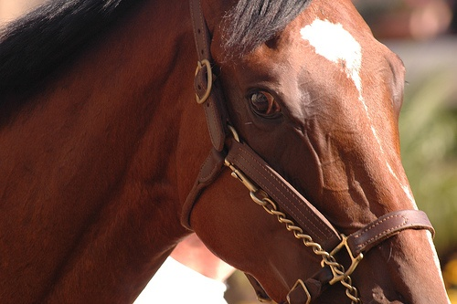
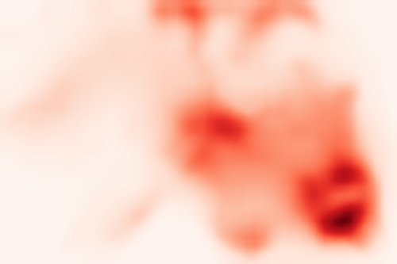

# Anonymous-AdvCAM

CVPR 2021 anonymous submission, Paper ID: 4016.

Input Image   |  Initial CAM   | Successive Maps with adversarial climbing
:-------------------------:|:-------------------------:|:-------------------------:
  |   | 

# Installation

We kindly refer to the offical implementation of [IRN](https://github.com/jiwoon-ahn/irn).


## Usage

#### Step 1. Prepare Dataset

- Download PASCAL VOC 2012 benchmark: [Download](https://drive.google.com/file/d/1XqdCzu5foG5R8khSG6LSwtx2BqiIAGco/view?usp=sharing).


#### Step 2. Prepare pre-trained classifier

- Pre-trained model used in this paper: [Download](https://drive.google.com/file/d/1ZV2qT7R5X4HsiyHiw1CHf3mGL3f5RNq5/view?usp=sharing).
- You can also train your own classifiers following [IRN](https://github.com/jiwoon-ahn/irn).

#### Step 3. Obtain the initial seeds for PASCAL VOC train images and evaluate them
```
bash get_seed_quality.sh
```


#### Step 4. Obtain the pseudo ground-truth masks for PASCAL VOC train_aug images and evaluate them
```
bash get_mask_quality.sh
```

#### Step 5. Train a semantic segmentation network
- To train DeepLab-v2, we refer to [deeplab-pytorch](https://github.com/kazuto1011/deeplab-pytorch). However, this repo contains only COCO pre-trained model. We provide [ImageNet pre-trained model](https://drive.google.com/file/d/18b-Nv8u5DaDMekww_QR16pjmPoNTLm51/view?usp=sharing) for a fair comparison with the other methods.
